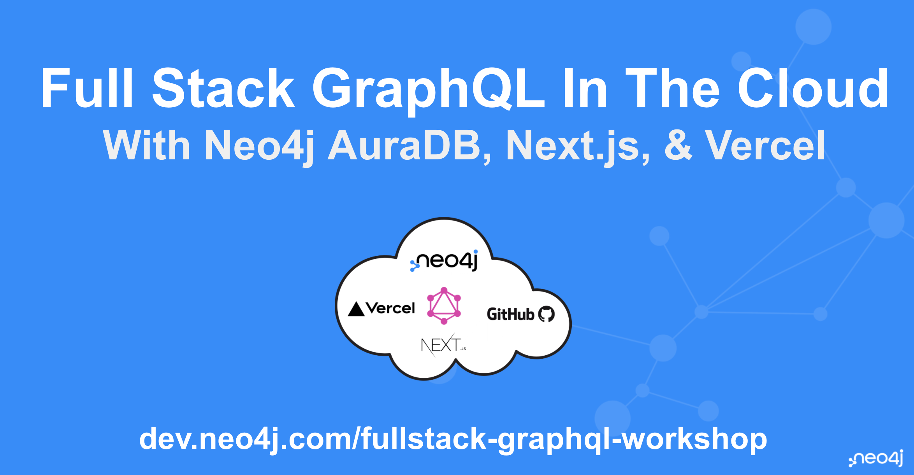

# Full Stack GraphQL In The Cloud With Neo4j AuraDB, Next.js, & Vercel Workshop

Slides: [dev.neo4j.com/fullstack-graphql-workshop](https://dev.neo4j.com/fullstack-graphql-workshop)

## Outline

* Introduction To Neo4j AuraDB
    - Importing And Querying Data With Cypher In The Cloud
* Building GraphQL APIs With The Neo4j GraphQL Library
* Introduction To Next.js
    - Next.js GraphQL Server With API Routes
    - Working With Client Side GraphQL
* Introduction To Vercel
    - Deploying Our Full Stack GraphQL Application

## Quickstart

* Click "Use this template" to create a new GitHub repo using this repo as a template
* See slides [here](https://dev.neo4j.com/fullstack-graphql-workshop)

